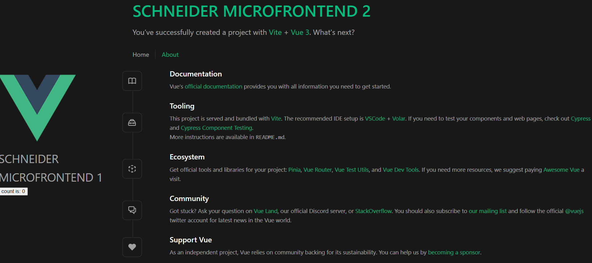

# Starter pack for Vite, Vue3 and Single SPA

The `microfrontend1` (JS) and `microfrontend2` (TS) are exposed on port `3000`/`3001`, respectively. You need to start each micro frontend following the instructions in the each `README`. Then, you can run the root config in order to expose both ports and consume the microfrontend from port `9000`

Please make sure you are using the correct node version by doing the following

```sh
nvm use
```

Current configuration



### Add another microfrontend?

You can follow the steps:

- [x] In order to create the microfrontend, please run the following command `npm create vue@latest` from the root directory.
- [x] Install de dependencies from package.json by running `npm install`. Please, add `single-spa-vue` as a dependency.
- [x] Update the `main.ts` or `main.js` file with the correct configuration in order to use single spa. Example:

```sh
        import { createApp, h } from 'vue'
        import App from './App.vue'
        import router from './router'
        import singleSpaVue from 'single-spa-vue'

        const vueLifecycles = singleSpaVue({
        createApp,
        appOptions: {
            render() {
            return h(App, {
                props: {
                name: this.name,
                mountParcel: this.mountParcel,
                singleSpa: this.singleSpa
                }
            })
            }
        },
        handleInstance: (app) => {
            app.use(router)
        }
        })
        export const bootstrap = vueLifecycles.bootstrap
        export const mount = vueLifecycles.mount
        export const unmount = vueLifecycles.unmount
```

- [x] Launch the microfrontend by running `npm run dev`
- [x] Register the microfrontend in the root configuration where `PORT` is the port number the microfrontend is running

```sh
        registerApplication({
          name: "microfrontend_name",
          app: () =>
            import(
              /* webpackIgnore: true */
              "http://localhost:[PORT]/src/main.(js,ts)"
            ),
          activeWhen: ["/"],
        });
```
